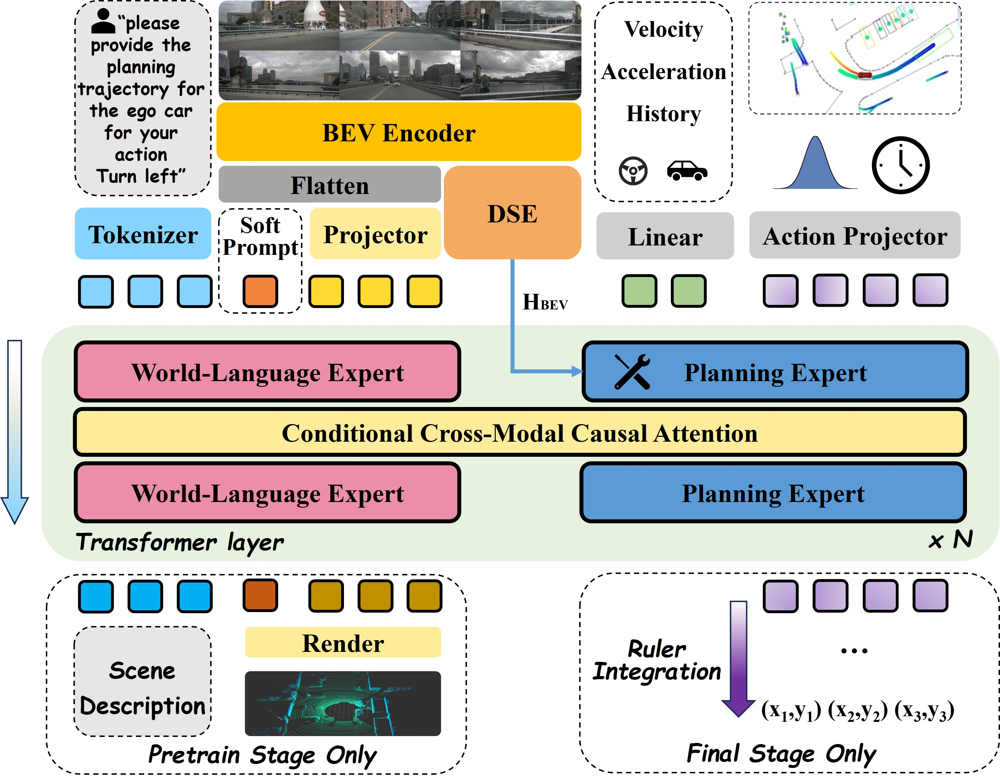
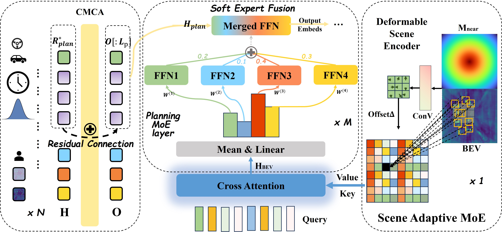
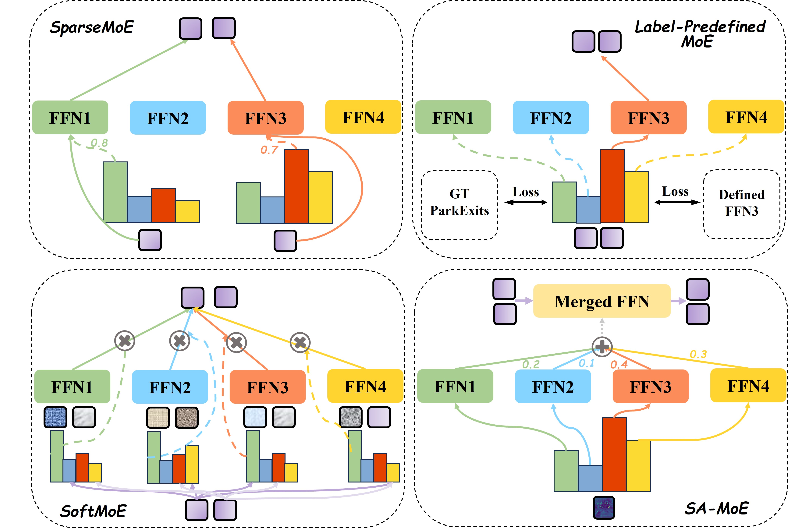

# SAMoE-VLA


Implementation of **SAMoE-VLA**, a scene-adaptive Vision-Language-Action framework for autonomous driving.

---

# Abstract

Recent advances in Vision-Language-Action (VLA) models have shown promising capabilities in autonomous driving by leveraging the understanding and reasoning strengths of Large Language Models (LLMs). However, our empirical analysis reveals that directly applying existing token-level MoE mechanisms—which are inherited from LLM architectures—to VLA models results in unstable performance and safety degradation in autonomous driving, highlighting a misalignment between token-based expert specialization and scene-level decision-making. To address this, we propose **SAMoE-VLA**, a scene-adaptive Vision-Language-Action framework that conditions expert selection on structured scene representations instead of token embeddings. Our key idea is to derive the MoE routing signal from bird’s-eye-view (BEV) features that encapsulate traffic scene context, enabling scenario-dependent expert weighting and merging tailored to distinct driving conditions. Furthermore, to support temporally consistent reasoning across world-knowledge, perception, language, and action, we introduce a **Conditional Cross-Modal Causal Attention** mechanism that integrates world state, linguistic intent, and action history into a unified causal reasoning process. Extensive experiments on the **nuScenes open-loop planning dataset** and **LangAuto closed-loop benchmark** demonstrate that SAMoE-VLA achieves state-of-the-art performance, outperforming prior VLA-based and world-model-based approaches with fewer parameters. Our code will be released soon.

---

# Overview

### SAMoE-VLA Framework



Overview of our SAMoE-VLA. SAMoE-VLA employs two functional experts. A **World-Language Expert**: This module performs multimodal processing by inte-
grating tokenized human instructions, Bird’s-Eye-View (BEV) tokens and soft prompts for world embeddings. A **Planning Expert**: This expert utilizes a structure based on a scene adaptive Mixture-of-Experts (SAMoE) layers routed by the scene representation extracted from Deformable Scene Encoder and receives ego-state tokens and noisy action tokens as its input. Our model unifies these experts through Conditional Cross-Modal Causal Attention(CMCA).


---

### Scene-Adaptive MoE



Overview of our Scene Adaptive MoE guided by Deformable Scene Encoder. **SA-MoE** is the layer of our proposed planning expert shown in figure~\ref{fig:pipeline}. BEV hidden is calculated only once during inference, while expert weights need to be calculated in every layer. 

---

### Comparison between different MoE



---

# Getting Started

## Environment Setup

This project uses **CUDA 11.8** and recommends **Conda** for environment management.

Follow this guide to set up your environment for running **SAMoE-VLA**.

---

## 1. Create and Activate Conda Environment

```bash
conda create -n samoe_vla python=3.9 -y
conda activate samoe_vla
pip install --upgrade pip setuptools wheel
```

---

## 2. Install InternVL and Dependencies

```bash
pip install torch==2.0.1 torchvision==0.15.2 torchaudio==2.0.2 --index-url https://download.pytorch.org/whl/cu118
pip install mmcv-full==1.5.0
pip install mmdet==2.24.0
pip install -r requirements_internvl.txt
pip install flash-attn==2.3.6 --no-build-isolation
```

## 3. Install MMDet3D and Additional Packages

```bash
pip install einops fvcore seaborn iopath==0.1.9 timm==0.6.13 typing-extensions==4.5.0 pylint ipython==8.12 numpy==1.22 matplotlib==3.5.2 numba==0.57 pandas==1.4.4 scikit-image==0.19.3 setuptools==59.5.0 boto3
python -m pip install 'git+https://github.com/facebookresearch/detectron2.git'
pip install plyfile==1.0.3 nuscenes-devkit==1.1.10 plotly==5.22.0 pandas==1.4.4 scipy==1.10.1 flake8==7.1.0 pytest==8.2.2 lyft_dataset_sdk yapf==0.40.1
python setup.py install
```

---

## 4. Compile Third-Party Libraries

```bash
cd third_lib/chamfer_dist/chamferdist/
pip install .
cd ../../..

cd projects/mmdet3d_plugin/bevformer/backbones/ops_dcnv3
sh make.sh
cd ../../../../..
```

---

## 5. Install PyG Dependency

```bash
pip install https://data.pyg.org/whl/torch-2.0.0%2Bcu118/torch_scatter-2.1.2%2Bpt20cu118-cp39-cp39-linux_x86_64.whl
```

---

## 6. Install InternVL-Chat Plugin

```bash
cd projects/mmdet3d_plugin/models/internvl_chat
pip install -e .
pip install numba==0.57 torchmetrics==1.4.1 networkx==2.5
```


# News

* **2026.03** 🔥 We release the core code of **SAMoE**.
* **2026.03** 🔧 We release the environment setup for **SAMoE-VLA**.
